# Aetherflow

Aetherflow is a Windows-first controller adapter host built around a
host-authoritative runtime. The target Windows package uses a small wrapper
executable that launches the real runtime under `lib/`, native plugins load
from a dedicated plugin tree, Python helpers stay out of process, and managed
Python environments live outside the packaged app root.

## Current Repo Scope

The repository currently contains:

- a current Python application entrypoint in `src/aetherflow/main.py`
- a repo-root convenience shim in `main.py` that forwards to
  `aetherflow.main:main`
- core runtime, entitlement, diagnostics, environment, IPC, and transitional
  worker-integration modules under `src/aetherflow/core/`
- input, output, plugin, security, UI, utility, and vision packages under
  `src/aetherflow/`
- a frozen control-plane proto at `proto/capture.proto`
- a native contract harness at `host/native_harness.cpp`
- the public native plugin ABI header at `include/plugin_system.hpp`
- automated coverage across unit, integration, UI, contract, end-to-end, and
  stress suites under `tests/`

## Runtime Model

The items below describe the intended packaged runtime layout. They do not mean
the source repository already contains a repo-root `lib/` directory today.
That tree is a packaging output target, not the current development layout.

- Root `Aetherflow.exe` is the wrapper/bootstrap executable.
- `lib/Aetherflow2.exe` is the primary runtime executable.
- `plugins/` is the primary plugin DLL load directory.
- `lib/plugins/` is a runtime-support subtree, not a replacement for `plugins/`.
- Plugin translations live under `lib/translations/plugins/<PluginName>/`.
- Managed Python runtimes, `uv.exe`, and workload `.aenv` environments live
  under `%LOCALAPPDATA%/AetherflowProject/Aetherflow/python/`, not inside the
  packaged app root.
- Python application code lives in `src/aetherflow/`.
- Native C++ host and boundary code live in `host/` and `include/`.
- The canonical control-plane contract is `proto/capture.proto`.
- Shared-memory layout lives in `src/aetherflow/core/shared_memory_layout.py`.

```mermaid
flowchart TB
    Root["Packaged Root"]
    Managed["Managed Python Runtime<br/>%LOCALAPPDATA%/AetherflowProject/Aetherflow/python/"]

    Root --> Exe["Aetherflow.exe<br/>wrapper"]
    Root --> Ini["aetherflow_settings.ini"]
    Root --> QtConf["qt.conf"]
    Root --> Version["version_info.json"]
    Root --> Lib["lib/"]
    Root --> Plugins["plugins/"]
    Root --> Scripts["scripts/"]

    Exe --> RuntimeExe["lib/Aetherflow2.exe<br/>primary runtime"]

    Lib --> RuntimeExe
    Lib --> LibCore["Core DLLs and EXEs"]
    Lib --> LibQt["Qt Runtime Subtrees"]
    Lib --> LibPy["Python Helper Payloads"]
    Lib --> LibCvHost["cv_python_host/ and CVPythonHost.exe"]
    Lib --> LibStyles["Styles and Layouts"]
    Lib --> LibTranslations["Translations"]
    Lib --> LibCv["cv_cpp/ helper runtime"]
    Lib --> LibGpc["gpc3/ helper runtime"]
    Lib --> LibPluginSupport["lib/plugins/<support payloads>"]

    LibQt --> Platforms["platforms/"]
    LibQt --> ImageFormats["imageformats/"]
    LibQt --> IconEngines["iconengines/"]
    LibQt --> Tls["tls/"]
    LibQt --> NetworkInfo["networkinformation/"]
    LibTranslations --> CoreTranslations["translations/core/"]
    LibTranslations --> PluginTranslations["translations/plugins/<PluginName>/"]

    Plugins --> PluginDlls["Primary plugin DLL load tree"]
    Plugins --> PluginMetadata["Colocated metadata and current root-level .qm files"]

    Scripts --> Automation["aetherflow_automation bundle"]
    Scripts --> Creation["aetherflow_creation bundle"]
    Scripts --> Sports["aetherflow_sports_companion bundle"]

    Managed --> ManagedPython["managed-python/<cpython>/python.exe"]
    Managed --> ManagedUv["uv.exe"]
    Managed --> ManagedCv["cv/"]
    ManagedCv --> ManagedAenv["cv/.aenv/"]
    ManagedCv --> ManagedReqs["cv/requirements.txt"]
```

See [docs/architecture/delivery-runtime-layout.md](docs/architecture/delivery-runtime-layout.md) for the full packaged tree and [docs/architecture/system_overview.md](docs/architecture/system_overview.md) for the higher-level runtime view.

## Repository Layout

- `src/aetherflow/core/`: runtime state, services, entitlements, diagnostics,
  environment bootstrap, verification, shared-memory layout, IPC clients, and
  transitional worker-integration code
- `src/aetherflow/ui/`: shell and routing models
- `src/aetherflow/plugins/`: catalog, manifest, trust, and registry logic
- `src/aetherflow/input/` and `src/aetherflow/output/`: input/output adapters
- `src/aetherflow/security/`: signing and redaction helpers
- `src/aetherflow/proto/`: generated Python protobuf and gRPC artifacts
- `host/`: native harness and native boundary documentation
- `include/`: public C++ ABI headers
- `proto/`: frozen protocol definitions
- `tests/`: unit, integration, contract, UI, e2e, and stress coverage
- `docs/`: PRD, implementation plan, architecture notes, evidence, and breaking
  change guidance
- `scripts/`: environment, packaging, e2e, and native-build PowerShell helpers
- `tools/`: development-only packaging, validation, and repo-maintenance helpers; not part of the shipped app

## Getting Started

Environment and tooling are Windows 11 + PowerShell with Python managed by
`uv`.

1. Sync dependencies with `uv sync`.
2. Create a local `.env` from `.env.example` for developer-specific settings.
3. Launch the current Python app entrypoint with `uv run aetherflow`.
4. Launch the current GUI script entrypoint with `uv run aetherflow-gui`.

Today, `aetherflow.main:main` configures the environment, builds the shell
model, loads pending developer app checks, and starts the current Qt
application path. This is distinct from the planned packaged Windows wrapper
executable described in the runtime model above.

## Development Focus

- Product-delivery work should focus on `host/`, `include/`, `src/aetherflow/`, `proto/`, packaged runtime docs, and shipped-behavior tests.
- `tools/` is development-only support infrastructure. Work there only when the task is explicitly about packaging, validation, or repo maintenance.

## Validation

Run the core validation commands before marking work complete:

- Build generated assets: `uv run python -m tools.build_assets`
- Lint: `uv run ruff check .`
- Tests: `uv run pytest`
- Combined quality gate: `uv run python -m tools.check_quality`
- Windows wrapper: `pwsh -ExecutionPolicy Bypass -File scripts/check-quality.ps1`

For the native harness specifically:

- Build and validate the contract boundary with  
  `pwsh -ExecutionPolicy Bypass -File scripts/build-native.ps1`
- The native build script expects Visual Studio Build Tools with the C++ toolset
  available on the machine.

## Documentation

- Product requirements: `docs/PRD.md`
- Implementation plan: `docs/PLAN.md`
- Architecture overview: `docs/architecture/system_overview.md`
- Requirements coverage snapshot: `docs/requirements-report.md`
- Native boundary notes: `host/README.md`
