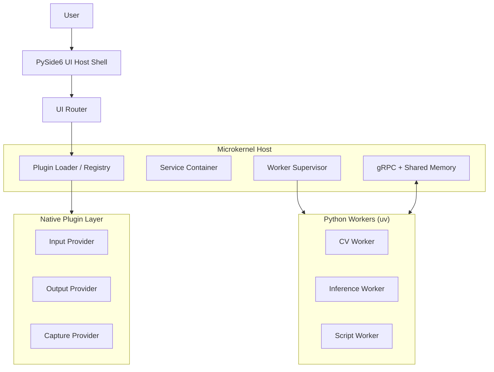

# Aetherflow

Aetherflow is a Windows-first controller adapter host that combines a native
C++ boundary with out-of-process Python services and a PySide6 shell. The repo
is structured around a microkernel-style host, frozen control-plane contracts in
`proto/`, and Python application code under `src/aetherflow/`.

## Current Repo Scope

The repository currently contains:

- a Python bootstrap entrypoint in `src/aetherflow/main.py`
- core runtime, entitlement, diagnostics, environment, and worker-supervision
  modules under `src/aetherflow/core/`
- input, output, plugin, security, UI, utility, and vision packages under
  `src/aetherflow/`
- a frozen control-plane proto at `proto/capture.proto`
- a native contract harness at `host/native_harness.cpp`
- the public native plugin ABI header at `include/plugin_system.hpp`
- automated coverage across unit, integration, UI, contract, end-to-end, and
  stress suites under `tests/`

## Architecture Boundaries

- Python application code lives in `src/aetherflow/`.
- Native C++ host and boundary code live in `host/` and `include/`.
- The canonical control-plane contract is `proto/capture.proto`.
- Shared-memory layout lives in `src/aetherflow/core/shared_memory_layout.py`.
- The native harness enforces the repo boundary and validates the frozen
  contract inputs.

See `docs/architecture/system_overview.md` for the higher-level runtime view.

## Repository Layout

- `src/aetherflow/core/`: runtime state, services, entitlements, diagnostics,
  environment bootstrap, verification, shared-memory layout, and worker
  supervision
- `src/aetherflow/ui/`: shell and routing models
- `src/aetherflow/plugins/`: catalog, manifest, trust, and registry logic
- `src/aetherflow/input/` and `src/aetherflow/output/`: input/output adapters
- `src/aetherflow/security/`: signing and redaction helpers
- `src/aetherflow/proto/`: generated Python protobuf and gRPC artifacts
- `host/`: native harness and native boundary documentation
- `include/`: public C++ ABI headers
- `proto/`: frozen protocol definitions
- `tests/`: unit, integration, contract, UI, e2e, and stress coverage
- `docs/`: PRD, implementation plan, architecture notes, evidence, and breaking
  change guidance
- `scripts/`: environment, packaging, e2e, and native-build PowerShell helpers

## Getting Started

Environment and tooling are Windows 11 + PowerShell with Python managed by
`uv`.

1. Sync dependencies with `uv sync`.
2. Create a local `.env` from `.env.example` for developer-specific settings.
3. Launch the shared Python entrypoint with `uv run aetherflow`.
4. Launch the GUI script entrypoint with `uv run aetherflow-gui`.

The current application entrypoint configures the environment, builds the shell
model, loads pending developer app checks, and starts the bootstrap sequence.

## Validation

Run the core validation commands before marking work complete:

- Build generated assets: `uv run python -m tools.build_assets`
- Lint: `uv run ruff check .`
- Tests: `uv run pytest`
- Combined quality gate: `uv run python -m tools.check_quality`
- Windows wrapper: `pwsh -ExecutionPolicy Bypass -File scripts/check-quality.ps1`

For the native harness specifically:

- Build and validate the contract boundary with  
  `pwsh -ExecutionPolicy Bypass -File scripts/build-native.ps1`
- The native build script expects Visual Studio Build Tools with the C++ toolset
  available on the machine.

## Documentation

- Product requirements: `docs/PRD.md`
- Implementation plan: `docs/PLAN.md`
- Architecture overview: `docs/architecture/system_overview.md`
- Requirements coverage snapshot: `docs/requirements-report.md`
- Native boundary notes: `host/README.md`
