# Aetherflow Packaged Runtime Layout

## Purpose

This document is the canonical packaged runtime tree for Windows v1 `P0`.
Agents must build the packaged runtime tree exactly from this document unless a
later signed-off manifest supersedes it.

This is a distribution manifest, not a claim about the current source-tree
shape at repo root. Directories such as `lib/` describe the packaged output
tree that packaging/build steps must produce.

## Canonical Root Tree

```text
Aetherflow.exe
aetherflow_settings.ini
qt.conf
version_info.json
lib/
plugins/
scripts/
```

## Launch Model

The packaged application has two executable roles and agents must preserve both:

- `Aetherflow.exe`
  - packaged at the root
  - small bootstrap or wrapper executable
  - responsible for delegating into the real runtime entry point under `lib/`
- `lib/Aetherflow2.exe`
  - packaged under `lib/`
  - primary runtime executable
  - owns the real application startup path after wrapper delegation

Agents must not collapse these roles into one file, rename both to the same
role, or remove the wrapper-runtime distinction during packaging work.

### Dual-Executable Contract

- root `Aetherflow.exe` is the small wrapper/bootstrap executable.
- `lib/Aetherflow2.exe` is the primary runtime executable.
- Packaging and validation must treat these as different roles, not duplicate
  binaries.

## Runtime Observations

These observations are here so agents do not flatten or misread the package:

- `plugins/` is the primary plugin-binary load directory.
- `plugins/` currently contains both plugin DLLs and root-level plugin
  translation `.qm` files.
- `lib/translations/plugins/<PluginName>/` also exists.
- `lib/plugins/` is a runtime-support subtree, not a replacement for the root
  `plugins/` directory.
- `cv` in helper names means `computer vision`.
- `.aenv` means `Aetherflow environments`.

## Plugin Translation Canonical Placement

- The current package shape contains plugin translation files both at the root
  of `plugins/` and under `lib/translations/plugins/<PluginName>/`.
- Canonical placement for plugin translation files is
  `lib/translations/plugins/<PluginName>/`.
- Root `plugins/` is for plugin binaries and declared colocated metadata;
  package normalization should move plugin `.qm` files out of root `plugins/`
  and into `lib/translations/plugins/<PluginName>/`.

## Canonical Runtime Tree

```text
Aetherflow.exe
aetherflow_settings.ini
qt.conf
version_info.json
lib/
  Aetherflow2.exe
  AetherflowCore.dll
  AetherflowUpdater.exe
  aetherflow-obs.dll
  InferenceCore.dll
  Qt6Core.dll
  Qt6Gui.dll
  Qt6Network.dll
  Qt6OpenGL.dll
  Qt6OpenGLWidgets.dll
  Qt6Svg.dll
  Qt6Widgets.dll
  WebView2Loader.dll
  cv_cpp/
    AetherflowCvWrapper.exe
    CaptureVisionTest.dll
    AetherflowCvSdk.h
    opencv_core4.dll
    zlib1.dll
  generic/
    qtuiotouchplugin.dll
  gpc3/
    gpc3vm-run.exe
    gpc3vmc.exe
  cv_python_host/
    CVPythonHost.exe
  iconengines/
    qsvgicon.dll
  imageformats/
    qgif.dll
    qicns.dll
    qico.dll
    qjpeg.dll
    qsvg.dll
    qtga.dll
    qtiff.dll
    qwbmp.dll
    qwebp.dll
  layouts/
    Full.ini
    Remote Play.ini
    Titan.ini
  networkinformation/
    qnetworklistmanager.dll
  platforms/
    qwindows.dll
  plugins/
    psremoteplay.json
    View.dll
  CVPythonHost.exe
  py/
    aetherflow_capture_test.py
    aetherflow_gcv_launcher.py
    aetherflow_gcv_wrapper.cp310-win_amd64.pyd
    aetherflow_gcv_wrapper.cp311-win_amd64.pyd
    aetherflow_gcv_wrapper.cp312-win_amd64.pyd
    aetherflow_gcv_wrapper.cp313-win_amd64.pyd
    aetherflow_gcv_wrapper.cp314-win_amd64.pyd
    aetherflow_gcv_wrapper.cp38-win_amd64.pyd
    aetherflow_gcv_wrapper.cp39-win_amd64.pyd
    aetherflow_gtuner.cp310-win_amd64.pyd
    aetherflow_gtuner.cp311-win_amd64.pyd
    aetherflow_gtuner.cp312-win_amd64.pyd
    aetherflow_gtuner.cp313-win_amd64.pyd
    aetherflow_gtuner.cp314-win_amd64.pyd
    aetherflow_gtuner.cp38-win_amd64.pyd
    aetherflow_gtuner.cp39-win_amd64.pyd
    inference_core.cp310-win_amd64.pyd
    inference_core.cp311-win_amd64.pyd
    inference_core.cp312-win_amd64.pyd
    inference_core.cp313-win_amd64.pyd
    inference_core.cp314-win_amd64.pyd
    inference_core.cp38-win_amd64.pyd
    inference_core.cp39-win_amd64.pyd
    InferenceCore.dll
    ring_buffer_reader.cp310-win_amd64.pyd
    ring_buffer_reader.cp311-win_amd64.pyd
    ring_buffer_reader.cp312-win_amd64.pyd
    ring_buffer_reader.cp313-win_amd64.pyd
    ring_buffer_reader.cp314-win_amd64.pyd
    ring_buffer_reader.cp38-win_amd64.pyd
    ring_buffer_reader.cp39-win_amd64.pyd
  styles/
    assets/
      snow_pattern.svg
      sweater_knit.svg
    Charcoal by xed.qss
    Christmas Eve.qss
    Color by xed.qss
    Dark.qss
    Darker.qss
    Gemini Dark.qss
    Gemini Light.qss
    Hacker by Kem.qss
    Light.qss
    Modern Hacker.qss
    Purple Future.qss
    qmodernwindowsstyle.dll
    Ugly Christmas Sweater.qss
  tls/
    qcertonlybackend.dll
    qopensslbackend.dll
    qschannelbackend.dll
  translations/
    core/
      aetherflow_de.qm
      aetherflow_en.qm
      aetherflow_es.qm
      aetherflow_fr.qm
      aetherflow_zh.qm
    plugins/
      CVPython/
        cvpython_de.qm
        cvpython_en.qm
        cvpython_es.qm
        cvpython_fr.qm
        cvpython_zh.qm
      DeviceMonitor/
        devicemonitor_de.qm
        devicemonitor_en.qm
        devicemonitor_es.qm
        devicemonitor_fr.qm
        devicemonitor_zh.qm
      FileExplorer/
        fileexplorer_de.qm
        fileexplorer_en.qm
        fileexplorer_es.qm
        fileexplorer_fr.qm
        fileexplorer_zh.qm
      MFCapture/
        mfcapture_de.qm
        mfcapture_en.qm
        mfcapture_es.qm
        mfcapture_fr.qm
        mfcapture_zh.qm
      OBSCapture/
        obscapture_de.qm
        obscapture_en.qm
        obscapture_es.qm
        obscapture_fr.qm
        obscapture_zh.qm
      OpenCVCapture/
        opencvcapture_de.qm
        opencvcapture_en.qm
        opencvcapture_es.qm
        opencvcapture_fr.qm
        opencvcapture_zh.qm
      OpenGLDisplay/
        opengl_display_de.qm
        opengl_display_en.qm
        opengl_display_es.qm
        opengl_display_fr.qm
        opengl_display_zh.qm
      OutputPanel/
        outputpanel_de.qm
        outputpanel_en.qm
        outputpanel_es.qm
        outputpanel_fr.qm
        outputpanel_zh.qm
      TitanBridge/
        titanbridge_de.qm
        titanbridge_en.qm
        titanbridge_es.qm
        titanbridge_fr.qm
        titanbridge_zh.qm
      VideoDisplay/
        video_display_de.qm
        video_display_en.qm
        video_display_es.qm
        video_display_fr.qm
        video_display_zh.qm
      View/
        view_de.qm
        view_en.qm
        view_es.qm
        view_fr.qm
        view_zh.qm
      ViGEmOutput/
        vigemoutput_de.qm
        vigemoutput_en.qm
        vigemoutput_es.qm
        vigemoutput_fr.qm
        vigemoutput_zh.qm
      XInputInput/
        xinputinput_de.qm
        xinputinput_en.qm
        xinputinput_es.qm
        xinputinput_fr.qm
        xinputinput_zh.qm
plugins/
  CvCpp.dll
  CvPython.dll
  DeviceMonitor.dll
  DS4Input.dll
  DS5Input.dll
  DSCapture.dll
  FileExplorer.dll
  GPC3.dll
  MagewellCapture.dll
  MFCapture.dll
  OBSCapture.dll
  OnlineResources.dll
  OpenCVCapture.dll
  OpenGLDisplay.dll
  OutputPanel.dll
  PSRemotePlay.dll
  TitanBridge.dll
  VideoDisplay.dll
  ViGEmOutput.dll
  XboxRemotePlay.dll
  XInputInput.dll
  psremoteplay.json
scripts/
  _aetherflow_automation_main/
    automation_main.py
  _aetherflow_creation_main/
    creation_main.py
  _aetherflow_sports_companion_main/
    sports_companion_main.py
    companion_bot.cp311-win_amd64.pyd
    companion_extra.cp311-win_amd64.pyd
    companion_gym.cp311-win_amd64.pyd
    companion_icon.cp311-win_amd64.pyd
    companion_helper.cp311-win_amd64.pyd
    companion_shot.cp311-win_amd64.pyd
    skeleton_core.cp311-win_amd64.pyd
    skeleton_extended.cp311-win_amd64.pyd
    net/
      companion_banner.png
      companion_icon.ico
      network_decoder.cp311-win_amd64.pyd
      network_divert.cp311-win_amd64.pyd
      network_gui.cp311-win_amd64.pyd
      network_runtime.dll
      network_runtime.py
      ui_network.cp311-win_amd64.pyd
      WinDivert64.sys
    netx/
      controller_runtime.cp311-win_amd64.pyd
      decoder_runtime.cp311-win_amd64.pyd
      divert_runtime.cp311-win_amd64.pyd
      netx_banner.png
      netx_gui.cp311-win_amd64.pyd
      netx_icon.ico
      netx_settings.json
      netx_runtime.dll
      netx_runtime.py
      ui_netx.cp311-win_amd64.pyd
      WinDivert64.sys
    ui/
      companion_ui_icon.ico
      sports_companion_banner.png
      sports_companion_gui.cp311-win_amd64.pyd
      ui_sports_companion.cp311-win_amd64.pyd
    userdata/
      creative/
        PremiumCreativeTools.cp311-win_amd64.pyd
        StandardCreativeTools.cp311-win_amd64.pyd
        util/
          creative_settings.json
          creative_banner.gif
          creative_icon.ico
          creative_launcher.cp311-win_amd64.pyd
          creative_main.cp311-win_amd64.pyd
          creative_ui.cp311-win_amd64.pyd
          creative_utils.cp311-win_amd64.pyd
          toggle_ui.cp311-win_amd64.pyd
          version.txt
      settings/
        meters/
          meter_arrow.json
          meter_arrow_alt.json
          meter_dial.json
          meter_pill.json
          meter_straight.json
          meter_sword.json
          meter_variant_2kol2.json
        sports_companion_settings.json
        vision_profile.txt
        online_profile.current
        online_profile_alt.json
```

## Managed Python Runtime Layout

This is not part of the packaged root tree. It is mutable runtime-managed state
created under the user profile by one-click installs and environment
management.

```text
%USERPROFILE%/AppData/Local/AetherflowProject/Aetherflow/python/
  managed-python/
    cpython-3.13.12-windows-x86_64-none/
      python.exe
  uv.exe
  cv/
    .aenv/
      Scripts/
        python.exe
    requirements.txt
```

## Managed Python Rules

- The `%LOCALAPPDATA%/AetherflowProject/Aetherflow/python/` tree is mutable
  managed runtime state, not packaged root content.
- `managed-python/` contains the managed interpreter payload.
- `uv.exe` lives in the managed Python root, not in the packaged root.
- Workload-specific environments live under
  `%LOCALAPPDATA%/AetherflowProject/Aetherflow/python/<workload>/.aenv/`.
- `cv/` is the computer-vision workload root.
- Agents must not package `.aenv` virtual environments into `dist/` unless a
  later requirement explicitly says to ship them.
- Packaging docs and validation must keep the packaged runtime tree separate
  from managed Python environment state.

## Runtime Classification

| Packaged path                | Runtime role                 | Allowed contents                                                                                                             |
| ---------------------------- | ---------------------------- | ---------------------------------------------------------------------------------------------------------------------------- |
| `Aetherflow.exe`             | wrapper bootstrap executable | top-level launcher only; delegates into `lib/Aetherflow2.exe`                                                                |
| `lib/Aetherflow2.exe`        | primary runtime executable   | real runtime entry point after wrapper delegation                                                                            |
| `lib/`                       | runtime support tree         | Qt runtime, helper executables, support DLLs, Python helper payloads, styles, layouts, translations, support plugin payloads |
| `plugins/`                   | primary plugin load tree     | plugin DLLs and explicitly declared colocated metadata only                                                                  |
| `scripts/`                   | shipped user script bundles  | user-facing script payloads only, never repo development tooling                                                             |
| `%LOCALAPPDATA%/.../python/` | managed runtime state        | managed interpreter, `uv`, workload roots, `.aenv` environments                                                              |

## Source Area Role Mapping

Each top-level source area must map to exactly one shipped role or be marked as
`development-only`.

| Source area              | Assigned role                                                                                                                        |
| ------------------------ | ------------------------------------------------------------------------------------------------------------------------------------ |
| `host/`                  | Source of truth for wrapper/primary runtime executable implementations and host-owned runtime DLL classes shipped in `lib/`.         |
| `include/`               | Source of truth for native ABI/header contracts compiled into host and plugin DLL artifacts.                                         |
| `proto/`                 | Source of truth for frozen control-plane schema used to generate shipping IPC stubs/contracts.                                       |
| `src/aetherflow/ui/`     | Source of truth for shell-only Python UI code shipped as runtime Python payloads, not host-supervision logic.                        |
| `src/aetherflow/core/`   | Source of truth for Python shell clients, IPC adapters, runtime models, and transitional logic to be retired where declared.         |
| `src/aetherflow/input/`  | Source of truth for input-domain Python modules that map to shell modules, helper payloads, or plugin-support resources.             |
| `src/aetherflow/output/` | Source of truth for output-domain Python modules that map to shell modules, helper payloads, or plugin-support resources.            |
| `src/aetherflow/vision/` | Source of truth for vision-domain Python modules and helper payload definitions for packaged runtime support.                        |
| `assets/`                | Source of truth for shipped styles, icons, layouts, and translation inputs consumed by packaged `lib/styles/` and translation trees. |
| `tools/`                 | `development-only` packaging/staging automation and validation scripts; not shipped as runtime payload.                              |

## Artifact Source-of-Truth Mapping

| Packaged artifact class                                                                         | Source-of-truth location                                                                                                         |
| ----------------------------------------------------------------------------------------------- | -------------------------------------------------------------------------------------------------------------------------------- |
| wrapper executable at root                                                                      | `host/` build outputs staged to packaged `Aetherflow.exe` at root.                                                               |
| primary runtime executable under `lib/`                                                         | `host/` build outputs staged to `lib/Aetherflow2.exe`.                                                                           |
| host DLLs                                                                                       | `host/` and `include/` native implementations/headers staged under `lib/`.                                                       |
| plugin DLLs                                                                                     | Native plugin build outputs from host/plugin sources staged under `plugins/`.                                                    |
| Python helper payloads under `lib/py/`                                                          | `src/aetherflow/` worker/helper Python modules and compiled extension payloads staged into `lib/py/`.                            |
| support executables under `lib/`                                                                | Native helper/runtime-support executables built from `host/` and staged under `lib/` subtrees.                                   |
| runtime-support payloads under `lib/plugins/`                                                   | Runtime support assets from plugin/runtime packaging inputs staged under `lib/plugins/`.                                         |
| Qt runtime assets under `lib/platforms`, `lib/imageformats`, `lib/tls`, and related directories | Packaging inputs from Qt runtime dependency distribution staged under `lib/` Qt subtrees.                                        |
| styles, layouts, and translation assets                                                         | `assets/` plus generated translation/style packaging inputs staged under `lib/styles/`, `lib/layouts/`, and `lib/translations/`. |
| packaged user script payloads under `scripts/`                                                  | Curated shipped script bundles sourced from release-approved script payload inputs, staged under `scripts/`.                     |
| managed Python runtime assets under `%LOCALAPPDATA%/AetherflowProject/Aetherflow/python/`       | Runtime-managed environment installer and environment manager outputs; never sourced from packaged root tree.                    |

## Runtime-only Subtree Placement Rules

Agents must treat the following paths as explicit placement rules and must not
guess alternate locations.

- `lib/cv_cpp/`: C++ computer-vision helper runtime subtree.
- `lib/gpc3/`: GPC runtime-support executables and related assets.
- `lib/cv_python_host/`: CV Python host launcher subtree.
- `lib/py/`: shipped Python helper payload subtree.
- `lib/plugins/`: runtime-support plugin subtree (not the primary plugin load
  tree).
- `lib/styles/`: shipped style engine assets and `.qss` payloads.
- `lib/translations/core/`: core product translation files.
- `lib/translations/plugins/<PluginName>/`: canonical plugin translation
  placement subtree.
- `scripts/_aetherflow_*` bundles: packaged user-facing script payload bundles
  only.

## Mermaid View

```mermaid
flowchart TB
    Root["Packaged Root"]
    Managed["Managed Python Runtime<br/>%LOCALAPPDATA%/AetherflowProject/Aetherflow/python/"]

    Root --> Exe["Aetherflow.exe<br/>wrapper"]
    Root --> Ini["aetherflow_settings.ini"]
    Root --> QtConf["qt.conf"]
    Root --> Version["version_info.json"]
    Root --> Lib["lib/"]
    Root --> Plugins["plugins/"]
    Root --> Scripts["scripts/"]

    Exe --> RuntimeExe["lib/Aetherflow2.exe<br/>primary runtime"]

    Lib --> RuntimeExe["Aetherflow2.exe<br/>primary runtime"]
    Lib --> LibCore["Core DLLs and EXEs"]
    Lib --> LibQt["Qt Runtime Subtrees"]
    Lib --> LibPy["Python Helper Payloads"]
    Lib --> LibCvHost["cv_python_host/ and CVPythonHost.exe"]
    Lib --> LibStyles["Styles and Layouts"]
    Lib --> LibTranslations["Translations"]
    Lib --> LibCv["cv_cpp/ helper runtime"]
    Lib --> LibGpc["gpc3/ helper runtime"]
    Lib --> LibPluginSupport["lib/plugins/<support payloads>"]

    LibQt --> Platforms["platforms/"]
    LibQt --> ImageFormats["imageformats/"]
    LibQt --> IconEngines["iconengines/"]
    LibQt --> Tls["tls/"]
    LibQt --> NetworkInfo["networkinformation/"]
    LibQt --> Generic["generic/"]

    LibTranslations --> CoreTranslations["translations/core/"]
    LibTranslations --> PluginTranslations["translations/plugins/<PluginName>/"]

    Plugins --> PluginDlls["Primary plugin DLL load tree"]
    Plugins --> LegacyPluginQm["Legacy root-level plugin .qm files<br/>normalize away"]
    Plugins --> PluginMetadata["Declared colocated metadata only"]

    Scripts --> Automation["aetherflow_automation bundle"]
    Scripts --> Creation["aetherflow_creation bundle"]
    Scripts --> Sports["aetherflow_sports_companion bundle"]

    Managed --> ManagedPython["managed-python/<cpython>/python.exe"]
    Managed --> ManagedUv["uv.exe"]
    Managed --> ManagedCv["cv/"]
    ManagedCv --> ManagedAenv["cv/.aenv/"]
    ManagedCv --> ManagedReqs["cv/requirements.txt"]
```



## Agent Rules

- Preserve subtree depth and artifact classes shown in this document.
- Preserve the wrapper plus runtime dual-executable model:
  `Aetherflow.exe` at root and `lib/Aetherflow2.exe` under `lib/`.
- Preserve the distinction between the packaged runtime tree and the managed
  Python runtime tree under `%LOCALAPPDATA%/.../python/`.
- Preserve the distinction between the primary plugin load tree at `plugins/`
  and the runtime-support subtree at `lib/plugins/`.
- If an artifact class is present in the packaged tree, section `2.0` work
  must map it to one explicit source-of-truth location in the repo.
