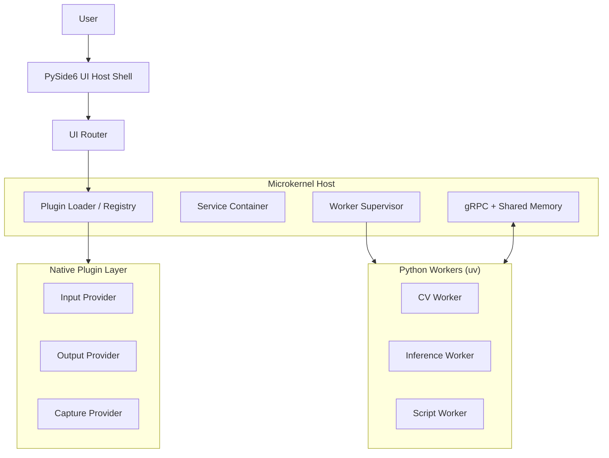
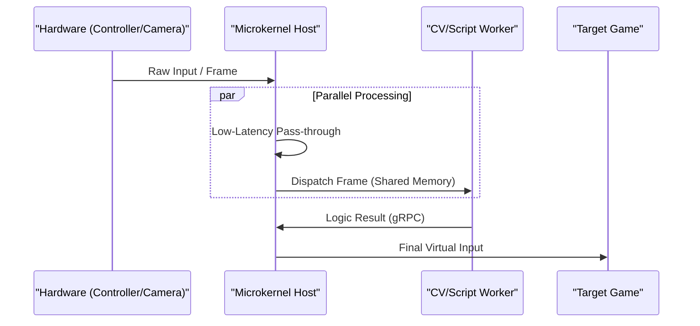
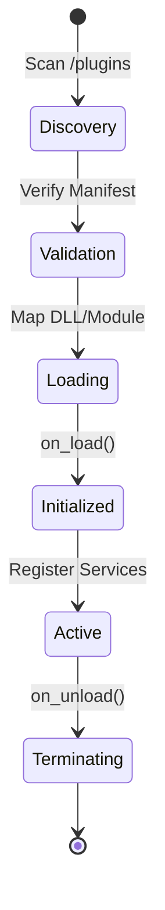
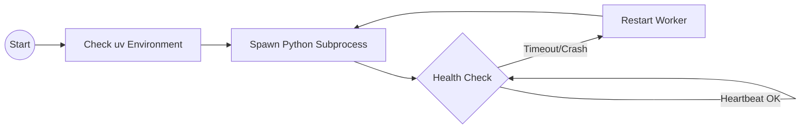

# Aetherflow System Architecture

## Overview

Aetherflow is a high-performance controller adapter ecosystem utilizing a microkernel host to manage native plugins and out-of-process Python workers via gRPC and shared memory.

## System Architecture

## Runtime Data Flow

## Plugin Lifecycle

## Worker Execution Model

