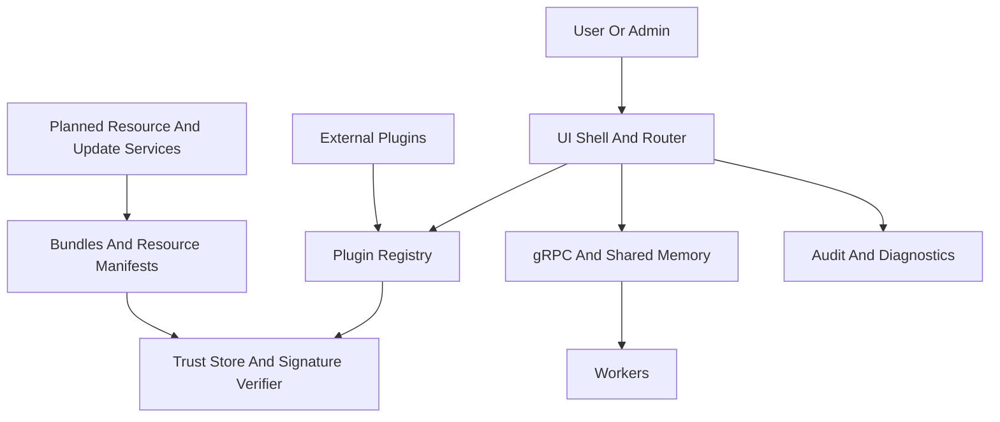

# Aetherflow Threat Model

## Executive summary

Aetherflow's highest-risk themes are supply-chain trust of native plugins,
signed manifests and bundles, privilege enforcement for enterprise admin
surfaces, and the planned expansion from a mostly local desktop host into a
network-connected worker, updater, and online-resource ecosystem. The most
important review areas are the plugin trust boundary, detached-signature trust
store handling, local privileged actions that depend on role checks, and the
planned gRPC/shared-memory worker path where malformed or hostile plugins,
workers, or update content could compromise integrity or availability.

## Scope and assumptions

- In-scope paths: `src/aetherflow/`, `proto/`, `include/`, `host/`,
  `assets/trust/manifest_keys.json`, `docs/PRD.md`, `docs/PLAN.md`,
  `docs/architecture/system_overview.md`, `.github/workflows/security.yml`.
- Out of scope for runtime findings: `tests/`, developer container setup, and
  local automation helpers under `tools/` except where they clarify security
  posture or CI controls.
- Assumption: current code is a mostly local Windows desktop application with
  implemented trust checks around plugins, manifests, bundles, routing,
  diagnostics redaction, and audit logging. Evidence anchors:
  `src/aetherflow/main.py`, `src/aetherflow/plugins/trust.py`,
  `src/aetherflow/core/resources_client.py`,
  `src/aetherflow/core/bundle_installer.py`.
- Assumption: planned PRD surfaces are in scope for ranking because the user
  requested that future worker, updater, online-resource, and admin-managed
  enterprise flows be modeled. Evidence anchors: `docs/PRD.md`,
  `docs/PLAN.md`, `docs/architecture/system_overview.md`.
- Assumption: safest route for unclear exposure is to treat future auth,
  resource, and update traffic as enterprise-relevant and potentially internet
  reachable, while current repo evidence shows mock or disabled OAuth rather
  than a live provider. Evidence anchors: `src/aetherflow/core/oauth.py`,
  `src/aetherflow/core/resources_client.py`, `docs/PRD.md`.
- Assumption: multi-user/admin-managed deployment increases the importance of
  role enforcement, audit integrity, and session or entitlement actions even
  though persistent identity and session backends are not yet fully implemented.
  Evidence anchors: `src/aetherflow/core/entitlements.py`,
  `src/aetherflow/ui/panels/admin_panel.py`,
  `src/aetherflow/core/audit_log.py`.

Open questions that would materially change the risk ranking:

- Which OAuth or identity provider will back enterprise auth and session
  revocation.
- Whether updater and online-resource endpoints will use mutual TLS,
  certificate pinning, or standard TLS only.
- Whether plugin or worker packages can come from third parties outside a
  vendor-controlled signing program.

## System model

### Primary components

- Windows desktop shell and router: local entrypoint plus route activation and
  role-based panel visibility in `src/aetherflow/main.py`,
  `src/aetherflow/ui/router.py`.
- Trust-aware plugin layer: manifest-driven registration with built-in versus
  external distribution checks in `src/aetherflow/plugins/manifest.py`,
  `src/aetherflow/plugins/registry.py`, `src/aetherflow/plugins/trust.py`.
- Signed content validation: detached Ed25519 manifest verification and signed
  bundle verification in `src/aetherflow/security/manifest_signing.py`,
  `src/aetherflow/core/resources_client.py`,
  `src/aetherflow/core/bundle_installer.py`.
- Privileged control surfaces: roles, entitlements, admin panel creation, audit
  logging, diagnostics export in `src/aetherflow/core/entitlements.py`,
  `src/aetherflow/ui/panels/admin_panel.py`,
  `src/aetherflow/core/audit_log.py`,
  `src/aetherflow/core/diagnostics_export.py`.
- Planned worker boundary: gRPC control plane and shared-memory frame exchange
  expressed as contracts in `proto/capture.proto`,
  `src/aetherflow/core/shared_memory_layout.py`, and health-state tracking in
  `src/aetherflow/core/worker_supervisor.py`.
- Native ABI boundary: frozen plugin ABI constants and load-decision structures
  in `include/plugin_system.hpp` with a minimal host harness in
  `host/native_harness.cpp`.
- CI and release hygiene: static analysis, tests, dependency audit, and secret
  scanning in `.github/workflows/security.yml`.

### Data flows and trust boundaries

- User or operator -> UI shell and router
  - Data: route names, admin actions, environment actions, resource selections.
  - Channel: local in-process UI calls.
  - Security guarantees: route visibility and activation checks use explicit
    role membership in `RouteDefinition.is_visible()` and
    `RouterModel.navigate()`; admin panel creation requires
    `RoleName.ADMIN_OPERATOR`.
  - Validation: route existence checks, role checks, explicit
    `PermissionError` failures. Evidence anchors: `src/aetherflow/ui/router.py`,
    `src/aetherflow/ui/panels/admin_panel.py`.
- Plugin manifest and artifact -> plugin registry and trust verifier
  - Data: plugin metadata, API version, artifact path, distribution origin,
    entitlement requirements.
  - Channel: local file and in-process registration.
  - Security guarantees: external plugins require an artifact path and
    Authenticode validation; API version mismatch fails closed; built-ins bypass
    external certificate checks.
  - Validation: manifest field usage plus PowerShell
    `Get-AuthenticodeSignature` result mapping. Evidence anchors:
    `src/aetherflow/plugins/registry.py`,
    `src/aetherflow/plugins/trust.py`,
    `src/aetherflow/plugins/manifest.py`.
- Signed manifest or bundle -> trust store and verifier
  - Data: canonical JSON payloads, detached signatures, signing key ids, sha256
    digests, archive size.
  - Channel: local file reads and in-process cryptographic verification.
  - Security guarantees: Ed25519 verification against a pinned JSON trust store;
    verification fails closed on missing trust store, unknown key, malformed
    signature, digest mismatch, or size mismatch.
  - Validation: canonical JSON serialization, base64 decoding, digest and size
    comparison. Evidence anchors:
    `src/aetherflow/security/manifest_signing.py`,
    `src/aetherflow/core/resources_manifest.py`,
    `src/aetherflow/core/bundle_installer.py`,
    `assets/trust/manifest_keys.json`.
- Host -> worker control plane and shared memory
  - Data: capture start and stop requests, worker heartbeats, worker logs,
    diagnostics export requests, frame metadata and pixel buffers.
  - Channel: planned gRPC plus shared memory.
  - Security guarantees: protocol contracts and restart budgets exist in repo,
    but authn, mTLS, ACLs, and memory-isolation controls are not yet evident in
    code.
  - Validation: proto schemas and structural shared-memory invariants only.
    Evidence anchors: `proto/capture.proto`,
    `src/aetherflow/core/shared_memory_layout.py`,
    `src/aetherflow/core/worker_supervisor.py`,
    `docs/PRD.md`.
- Admin action or diagnostics export -> local append-only logs and export files
  - Data: actor identity, target identity, action metadata, recent logs, worker
    and environment summaries.
  - Channel: local file append and JSON report write.
  - Security guarantees: audit entries are appended, and secret-like values are
    redacted before audit export or diagnostics export.
  - Validation: shallow and recursive redaction of tokens, bearer strings, JWTs,
    API keys, and URL userinfo. Evidence anchors:
    `src/aetherflow/core/audit_log.py`,
    `src/aetherflow/core/diagnostics_export.py`,
    `src/aetherflow/security/redaction.py`.
- Planned online resources and updater endpoints -> local host
  - Data: OAuth tokens, signed manifests, downloadable artifacts, entitlement
    state, update packages.
  - Channel: future network flows inferred from PRD and OAuth interface.
  - Security guarantees: provider abstraction exists, but current provider is a
    disabled mock and transport security details are not implemented.
  - Validation: current code validates signatures after retrieval, but endpoint
    auth, origin binding, and rollback enforcement are only partially modeled.
    Evidence anchors: `src/aetherflow/core/oauth.py`,
    `src/aetherflow/core/resources_client.py`, `docs/PRD.md`.

#### Diagram

## Assets and security objectives

| Asset                                            | Why it matters                                                                                  | Security objective (C/I/A) |
| ------------------------------------------------ | ----------------------------------------------------------------------------------------------- | -------------------------- |
| Native plugin load path and DLL artifacts        | Untrusted native code can compromise the host, user sessions, and downstream systems            | I/A                        |
| Manifest trust store and signing keys            | Trust-store manipulation can make malicious bundles or resource catalogs appear authentic       | I                          |
| Signed bundle and resource manifests             | These govern what content becomes installable or executable                                     | I                          |
| OAuth tokens and future session credentials      | Token theft could enable resource access, admin actions, or update abuse                        | C/I                        |
| Role and entitlement state                       | Incorrect grants can expose premium or admin-only actions across tenants or operators           | I                          |
| Shared-memory frames and worker control messages | Malicious inputs can crash workers, corrupt processing, or degrade host availability            | I/A                        |
| Audit logs and diagnostics exports               | These are needed for enterprise response and may contain sensitive operator or environment data | C/I                        |
| Update packages and rollback state               | Malicious updates can become a full compromise path for all managed endpoints                   | I/A                        |

## Attacker model

### Capabilities

- Remote attacker able to tamper with or impersonate future online resource,
  auth, or update responses if transport and origin controls are weak.
- Low-privilege local user on a managed workstation able to access local files,
  submit malicious plugin manifests, trigger UI actions, or inspect diagnostics.
- Malicious or compromised plugin publisher able to produce signed-but-hostile
  native artifacts, or obtain signing material through separate compromise.
- Malicious worker or plugin able to send malformed gRPC messages, spam logs, or
  abuse shared-memory contracts once admitted into the runtime.
- Insider administrator or compromised admin session able to mutate
  entitlements, roles, or sessions if backend controls are weaker than UI checks.

### Non-capabilities

- A purely remote unauthenticated attacker does not currently have evidence of a
  direct internet-facing listener in the checked-in code.
- There is no evidence in current code of a live multi-tenant database or web
  API that would create classic web injection risk in the present implementation.
- The current OAuth provider is disabled by default, so token exchange is not
  yet a live path in the repo as implemented.

## Entry points and attack surfaces

| Surface                      | How reached                      | Trust boundary                      | Notes                                                                               | Evidence (repo path / symbol)                                                       |
| ---------------------------- | -------------------------------- | ----------------------------------- | ----------------------------------------------------------------------------------- | ----------------------------------------------------------------------------------- |
| Route activation             | Local user navigation            | User -> UI shell                    | Role-gated for protected routes; failure events logged                              | `src/aetherflow/ui/router.py` / `RouterModel.navigate`                              |
| Admin panel creation         | Local admin workflow             | User -> admin surface               | Admin-only check is enforced in panel model construction                            | `src/aetherflow/ui/panels/admin_panel.py` / `AdminPanelModel.from_audit_log`        |
| Plugin registration          | Plugin manifest ingestion        | Plugin metadata -> registry         | External plugins depend on artifact path and trust result                           | `src/aetherflow/plugins/registry.py` / `PluginRegistry.register`                    |
| Authenticode verification    | External DLL load attempt        | Local artifact -> trust verifier    | Uses PowerShell signature status mapping; no sandboxing of DLL behavior after trust | `src/aetherflow/plugins/trust.py` / `PluginAuthenticodeVerifier.verify`             |
| Resource manifest validation | Resource catalog ingestion       | Signed manifest -> trust store      | Structural validation plus Ed25519 signature check                                  | `src/aetherflow/core/resources_client.py` / `validate_manifest`                     |
| Bundle install verification  | Bundle installation              | Signed bundle -> local installer    | Signature, digest, and size checks happen before READY state                        | `src/aetherflow/core/bundle_installer.py` / `install`                               |
| Trust store path resolution  | Env or settings load             | Config -> verifier                  | Trust store path can be overridden by settings                                      | `src/aetherflow/security/manifest_signing.py` / `resolve_manifest_trust_store_path` |
| Audit log append             | Admin action                     | Privileged action -> persistent log | Append-only intent, local file path configurable via settings                       | `src/aetherflow/core/audit_log.py` / `record`                                       |
| Diagnostics export           | User or admin diagnostics action | Runtime data -> export artifact     | Redaction exists but export still aggregates sensitive state                        | `src/aetherflow/core/diagnostics_export.py` / `export`                              |
| Worker heartbeat and logs    | Planned worker runtime           | Worker -> host IPC                  | Schema exists; auth or origin checks not evident                                    | `proto/capture.proto` / `ReportHeartbeat`, `ForwardWorkerLog`                       |
| Shared-memory ring layout    | Planned frame pipeline           | Host -> worker shared memory        | Structure validated, but producer identity and isolation are not evident            | `src/aetherflow/core/shared_memory_layout.py` / `SharedFrameRingLayout.validate`    |
| Future OAuth flows           | Planned enterprise auth          | External IdP -> host                | Current provider is mock-only; real provider choice unresolved                      | `src/aetherflow/core/oauth.py` / `OAuthProvider`                                    |
| Future updater channel       | Planned release flow             | Update service -> host              | PRD requires signed manifests and rollback; implementation not yet evident          | `docs/PRD.md` / `§9.11`                                                             |

## Top abuse paths

1. Attacker places or convinces an operator to install a malicious external
   plugin -> manifest points to a DLL with valid or fraudulently obtained
   signature -> registry trusts the artifact -> hostile native code executes in
   the host context -> host integrity is lost.
2. Attacker modifies the manifest trust store path or trust store contents ->
   malicious signing key becomes trusted -> resource or bundle signatures verify
   successfully -> hostile content becomes installable -> supply-chain
   compromise persists across managed endpoints.
3. Compromised admin session opens the admin surface -> assigns roles or
   entitlements outside intended policy -> non-admin or cross-tenant user gains
   privileged capabilities -> enterprise control-plane integrity is lost.
4. Malicious worker sends malformed heartbeats, logs, or oversized frame traffic
   across planned IPC boundaries -> host spends budget on restart or log
   handling -> capture or mapping features degrade or fail -> availability loss
   spreads across dependent plugins.
5. Adversary tampers with future update or online-resource responses -> host
   retrieves attacker-controlled manifest or package -> signature or origin
   validation is bypassed or weakened -> broad endpoint compromise.
6. Low-privilege local user triggers diagnostics export after inducing sensitive
   log content -> redaction misses edge-case tokens or local secrets -> export
   artifact leaks credentials, internal paths, or admin metadata.
7. Attacker abuses built-in plugin classification -> malicious functionality is
   shipped or mislabeled as built-in -> registry bypasses external certificate
   verification -> integrity compromise shifts from plugin signer trust to
   release-pipeline trust.

## Threat model table

| Threat ID | Threat source                                                          | Prerequisites                                                                                   | Threat action                                                                                        | Impact                                                                    | Impacted assets                                                               | Existing controls (evidence)                                                                                                                                                                                                                | Gaps                                                                                                                                                        | Recommended mitigations                                                                                                                                                                                                                                               | Detection ideas                                                                                                                                       | Likelihood | Impact severity | Priority |
| --------- | ---------------------------------------------------------------------- | ----------------------------------------------------------------------------------------------- | ---------------------------------------------------------------------------------------------------- | ------------------------------------------------------------------------- | ----------------------------------------------------------------------------- | ------------------------------------------------------------------------------------------------------------------------------------------------------------------------------------------------------------------------------------------- | ----------------------------------------------------------------------------------------------------------------------------------------------------------- | --------------------------------------------------------------------------------------------------------------------------------------------------------------------------------------------------------------------------------------------------------------------- | ----------------------------------------------------------------------------------------------------------------------------------------------------- | ---------- | --------------- | -------- |
| TM-001    | Malicious plugin publisher or local attacker with install ability      | Attacker can submit an external plugin manifest and DLL, or compromise a legitimate signer      | Deliver a hostile native plugin that passes trust checks and then runs with host privileges          | Full host compromise, persistence, unsafe input or output behavior        | Native plugin artifacts, host runtime, enterprise endpoints                   | External plugins require artifact path and Authenticode validation; invalid signatures fail closed (`src/aetherflow/plugins/trust.py`, `src/aetherflow/plugins/registry.py`)                                                                | Trust decision is largely signer-based; no evident allowlist of publishers, sandboxing, capability isolation, or post-load behavioral restrictions          | Enforce explicit publisher allowlists or enterprise trust policy, isolate plugin execution where feasible, record signer thumbprints in policy decisions, add revocation and reputation feeds, and require stronger provenance for built-ins and third-party packages | Alert on new signer thumbprints, denied plugin loads, repeated trust failures, and any plugin classified as built-in outside signed release inventory | Medium     | High            | high     |
| TM-002    | Local attacker, insider, or config-management compromise               | Attacker can edit `.env`, settings, or files under the app directory                            | Replace or redirect the manifest trust store so malicious bundles and resource catalogs validate     | Supply-chain compromise of resources, bundles, and future updates         | Trust store, resource manifests, bundle manifests, update packages            | Missing trust store, unknown key, unsupported algorithm, and invalid signature fail closed (`src/aetherflow/security/manifest_signing.py`, `src/aetherflow/core/bundle_installer.py`)                                                       | Trust store path is configurable, trust store is local JSON, and there is no evident OS-level protection, pin rotation workflow, or secondary root of trust | Lock trust store to a protected install location, require OS ACL checks before use, pin trust store hash or signer in code or installer metadata, and alert on trust-store path overrides                                                                             | Log every resolved trust-store path, hash, active key id, and override source; alert on path changes or unknown key ids                               | Medium     | High            | high     |
| TM-003    | Compromised admin session, insider admin, or auth design flaw          | Enterprise deployment with admin-managed roles and entitlements; real identity backend is added | Abuse admin-only flows to escalate roles, assign entitlements, or revoke sessions improperly         | Cross-user privilege escalation and control-plane abuse                   | Role state, entitlement state, audit integrity, sessions                      | Admin panel creation checks for `ADMIN_OPERATOR`; audit log appends entries and redacts metadata (`src/aetherflow/ui/panels/admin_panel.py`, `src/aetherflow/core/audit_log.py`)                                                            | Enforcement is centered in UI/model code; no backend authz boundary, approval workflow, tamper-evident audit, or session-binding evidence yet               | Implement server-side or service-layer authz checks, dual-control for sensitive admin actions, tamper-evident audit chains, and explicit authorization tests for every admin mutation path                                                                            | Alert on unusual entitlement assignments, role changes outside change windows, repeated revocations, and audit log truncation or rewrite attempts     | Medium     | High            | high     |
| TM-004    | Malicious worker, plugin, or malformed IPC sender                      | Planned worker runtime is implemented and attacker controls a worker or injects into IPC paths  | Send malformed heartbeats, log floods, or frame data that trigger restart loops or processing faults | Sustained degradation or failure of capture and worker-dependent features | Worker availability, shared memory frames, diagnostics signal quality         | Restart budgets and health states exist; shared-memory layout validates structural invariants (`src/aetherflow/core/worker_supervisor.py`, `src/aetherflow/core/shared_memory_layout.py`, `proto/capture.proto`)                            | No evident IPC authentication, origin binding, rate limiting, message size control, or shared-memory access control in current code                         | Add authenticated local IPC endpoints, enforce message size and rate limits, bind shared-memory names to per-session ACLs, and isolate worker crashes from host control-plane saturation                                                                              | Track restart storms, heartbeat anomalies, log-rate spikes, overflow counters, and invalid IPC schema events                                          | Medium     | Medium          | medium   |
| TM-005    | Network attacker, compromised CDN, or upstream service compromise      | Future online-resource or updater transport is internet reachable and origin controls are weak  | Tamper with resource or update retrieval to deliver malicious manifests or packages                  | Fleet-wide compromise of managed installs                                 | Update packages, resource catalogs, tokens, endpoint integrity                | PRD requires signed manifests, digest validation, and rollback; bundles and resource manifests already have detached signature checks (`docs/PRD.md`, `src/aetherflow/core/resources_client.py`, `src/aetherflow/core/bundle_installer.py`) | Live transport protections, endpoint auth, rollback enforcement, replay protection, and package quarantine are not implemented in repo                      | Require TLS with strong origin validation, signed metadata freshness, rollback indexes, replay-resistant manifests, staged rollout verification, and explicit quarantine plus rollback logic                                                                          | Alert on signature failures, package hash mismatches, version rollback anomalies, and update channel divergence across managed devices                | Medium     | High            | high     |
| TM-006    | Low-privilege local user or attacker with access to exported artifacts | Attacker can trigger diagnostics export or inspect output files                                 | Exfiltrate secrets or sensitive metadata through logs or diagnostics that redaction misses           | Credential exposure and enterprise information leakage                    | OAuth tokens, API keys, userinfo in URLs, admin metadata, environment details | Redaction handles bearer strings, OpenAI-style keys, JWTs, URL userinfo, and generic secret labels (`src/aetherflow/security/redaction.py`, `src/aetherflow/core/diagnostics_export.py`, `src/aetherflow/core/audit_log.py`)                | Redaction is pattern-based and shallowly semantic; exports still aggregate sensitive operational context, and new token formats may bypass regexes          | Minimize exported fields, classify diagnostics by role, add deny-by-default export sections, broaden secret detectors with tests, and encrypt or ACL-protect exported artifacts                                                                                       | Audit export generation, compare raw-versus-redacted samples in tests, and alert on exports containing high-entropy strings or known token prefixes   | Medium     | Medium          | medium   |
| TM-007    | Release-pipeline compromise or internal build error                    | Attacker compromises release process or a malicious component is packaged as built-in           | Mark hostile functionality as built-in so external signer checks are bypassed                        | Supply-chain integrity loss through trusted first-party channel           | Built-in plugin set, release artifacts, enterprise endpoints                  | Built-ins are treated as trusted while external artifacts require Authenticode (`src/aetherflow/plugins/trust.py`, `src/aetherflow/plugins/manifest.py`)                                                                                    | Built-in status shifts trust to the release pipeline; no manifest of approved built-ins, provenance, or measured-boot style verification is evident         | Maintain signed inventory of built-in plugins, verify manifest-to-package correspondence at startup, require reproducible release attestations, and review built-in deltas in CI                                                                                      | Alert on new built-in plugin ids, manifest drift between releases, and mismatch between packaged files and signed release inventory                   | Low        | High            | medium   |

## Criticality calibration

- `critical` for this repo means a path that allows silent execution of
  attacker-controlled native code or signed-update compromise across managed
  endpoints with weak recovery. Examples: a trusted malicious update package, a
  bypass of plugin trust leading to arbitrary native execution, or trust-store
  replacement that makes malicious bundles universally valid.
- `high` means compromise of integrity-critical enterprise controls or strong
  likelihood of full endpoint impact on a subset of systems. Examples: admin
  authorization bypass, malicious signed plugin admission, or online-resource
  tampering that defeats origin and signature assumptions.
- `medium` means feature-level denial of service, sensitive diagnostics leakage,
  or abuse that requires local access or strong preconditions but still affects
  important assets. Examples: worker restart storms, log flooding, or redaction
  bypass in exported diagnostics.
- `low` means issues with narrow blast radius, easy operator mitigation, or
  implausible prerequisites in the current architecture. Examples: non-sensitive
  route visibility leaks, malformed but non-exploitable UI state, or noisy local
  denial attempts that do not cross privilege boundaries.

## Focus paths for security review

| Path                                          | Why it matters                                                                                        | Related Threat IDs     |
| --------------------------------------------- | ----------------------------------------------------------------------------------------------------- | ---------------------- |
| `src/aetherflow/plugins/trust.py`             | Core native plugin trust boundary and external signer admission logic                                 | TM-001, TM-007         |
| `src/aetherflow/plugins/registry.py`          | Enforces trusted-versus-locked plugin registration behavior                                           | TM-001, TM-007         |
| `src/aetherflow/security/manifest_signing.py` | Root of trust for detached-signature verification and trust-store resolution                          | TM-002, TM-005         |
| `src/aetherflow/core/bundle_installer.py`     | Signed bundle validation path that will matter for managed installs and updates                       | TM-002, TM-005         |
| `src/aetherflow/core/resources_client.py`     | Resource-manifest trust boundary and future auth-connected content retrieval path                     | TM-002, TM-005         |
| `src/aetherflow/core/oauth.py`                | Future enterprise auth integration point with unresolved provider and token handling                  | TM-003, TM-005, TM-006 |
| `src/aetherflow/core/entitlements.py`         | Integrity-critical role and entitlement semantics for premium and admin features                      | TM-003                 |
| `src/aetherflow/ui/panels/admin_panel.py`     | Current admin-surface enforcement point that should not remain the only authz boundary                | TM-003                 |
| `src/aetherflow/core/audit_log.py`            | Enterprise evidence path whose integrity and tamper resistance matter for admin actions               | TM-003, TM-006         |
| `src/aetherflow/core/diagnostics_export.py`   | Aggregates potentially sensitive runtime state into exportable artifacts                              | TM-006                 |
| `src/aetherflow/security/redaction.py`        | Pattern-based redaction logic with possible blind spots for future secret formats                     | TM-006                 |
| `proto/capture.proto`                         | Planned worker control-plane contract and future IPC attack surface                                   | TM-004                 |
| `src/aetherflow/core/shared_memory_layout.py` | Planned data-plane boundary for frame exchange and memory safety assumptions                          | TM-004                 |
| `src/aetherflow/core/worker_supervisor.py`    | Availability control logic for crash loops and restart budgeting                                      | TM-004                 |
| `include/plugin_system.hpp`                   | Frozen native ABI and policy constants that shape plugin trust semantics                              | TM-001, TM-007         |
| `docs/PRD.md`                                 | Defines future online resources, updater, admin, and worker expectations that drive planned risk      | TM-003, TM-004, TM-005 |
| `.github/workflows/security.yml`              | CI security gates that partially defend release-pipeline trust but do not replace provenance controls | TM-007                 |
