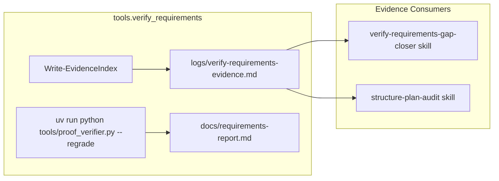

# Verify-Requirements Pipeline

## Generation Flow

1. `uv run python -m tools.verify_requirements` runs and:
   - Scans `src`, `include`, `host`, `docs`, `scripts`, `tests`, `proto`
   - Reads each file as text when possible and records size, placeholder
     status, and matched scaffolding markers
   - Treats generated `*_pb2.py` and `*_pb2_grpc.py` files as mature by rule
   - Writes `logs/verify-requirements-evidence.md` via `write_evidence_index()`
   - Runs `tools/proof_verifier.py --regrade`
   - Regenerates `logs/verification/*.json` and
     `logs/verification/status_snapshot.json`
   - Writes `docs/requirements-report.md`

2. Root `PLAN.md` (gap closure plan) is not generated by the script. It is
   maintained separately as the current-state verifier-hardening and closure
   plan after an agent reads `logs/verify-requirements-evidence.md` and
   `docs/requirements-report.md`.

3. Verification authority is intentionally singular:
   - canonical command: `uv run python -m tools.verify_requirements`
   - canonical evaluator: `src/aetherflow/core/verification_report.py`
   - canonical outputs: `docs/requirements-report.md` and
     `logs/verification/*.json`
   - **storage tier:** JSON outputs are **generated runtime** artifacts (Tier 2
     in `docs/governance/artifact-storage-policy.md`). They are regenerated by
     the canonical command and must not be treated as git-tracked canonical
     state. CI runs the command before pytest on clean checkouts.

4. Other tools are not equivalent authorities:
   - `tools/generate_verification_report.py` is a wrapper around the same core
     evaluator path and should not be treated as a second source of truth.
   - `tools/audit_plan_completion.py` is advisory only and may not promote,
     verify, or prove functionality.

5. Evidence and report files are summaries of proof status, not proof by
   themselves. A feature is only `verified` when executable proof covers the
   declared acceptance criteria through the intended entry point, includes
   relevant failure coverage, and has approved reviewer sign-off.

## Misclassified Files (Pre-Fix)

<!-- markdownlint-disable MD060 -->

<!-- prettier-ignore-start -->
| File                                        | Size   | Markers                   | Why Misclassified                                    |
|---------------------------------------------|--------|---------------------------|------------------------------------------------------|
| tools/plan_exec.py                          | 72,176 | placeholder;minimal;model | "model" in Pydantic, "minimal" in docstrings         |
| tools/validation_gate.py                    | 16,937 | model                     | "model" in `BaseModel`, `model_validator`            |
| tools/agent_call.py                         | 5,543  | model                     | "model" in API/LLM context                           |
| tools/context_utils.py                      | 3,999  | model                     | "model" in data-model context                        |
| tools/gbnf_grammars.py                      | 4,128  | model                     | "model" in grammar/model context                     |
| tools/json_utils.py                         | 5,909  | model                     | "model" in data-model context                        |
| src/aetherflow/core/entitlements.py         | 3,538  | model                     | "model" in Pydantic/schema context                   |
| src/aetherflow/core/shared_memory_layout.py | 7,262  | minimal;descriptor        | "descriptor" in proto/shmem context                  |
| src/aetherflow/proto/capture_pb2.py         | 3,699  | descriptor                | Generated proto; "descriptor" is structural          |
| docs/PLAN.md                                | 31,883 | placeholder;minimal;model | "model" in completion policy ("model-only wrappers") |
| docs/PRD.md                                 | 16,046 | model                     | "model" in requirements terminology                  |
<!-- prettier-ignore-end -->

<!-- markdownlint-enable MD060 -->

Root cause: `Get-PlaceholderMarkers` includes `model`, `minimal`, and
`descriptor`, which are common in real code (Pydantic, protobuf, docs).
`Test-Placeholder` returns true if any marker appears, so large files are
flagged.

## Heuristics (Post-Fix)

- Evidence placeholder = `Test-Placeholder` OR `Test-ThinCode`. Structurally
  thin files are flagged even without explicit markers.
- Explicit scaffolding markers: `TODO`, `placeholder`, `should implement`,
  `This file should implement`, `This header should define`, and similar
  markers.
- Contextual `minimal` marker: files < 2000 bytes containing `minimal` in
  docstrings are flagged. Large files (`plan_exec.py`, and similar) are not
  affected.
- Thinness (`Test-ThinCode`): Python: < 500 bytes, or no `def`, or (< 800 bytes
  and < 2 defs). Mature override: size >= 1500 and (def >= 3 or class >= 2).
- Structural overrides (`Test-MatureFile`): same thresholds; generated proto
  files are always mature.
- Opt-out: `# evidence: mature` comment opts a file out of placeholder
  detection.
- Test strength: `pytest.raises` and `@pytest.mark.parametrize` count toward
  assertion strength. Integration/UI tests use threshold 1; others use 2.
- Status heuristics and placeholder classifications are advisory only. They may
  help discover gaps, but they do not establish functional completion or
  performance verification.

## Debug And Regression Tests

- Debug mode: run
  `uv run python -m tools.verify_requirements --debug`
  to print heuristic results (mature, markers) for a golden set of files.
- Golden test:
  `uv run pytest tests/contracts/test_verify_requirements_evidence.py`
  asserts expected placeholder status for key files. Update
  `GOLDEN_EXPECTATIONS` when heuristics or implementation intentionally change.
