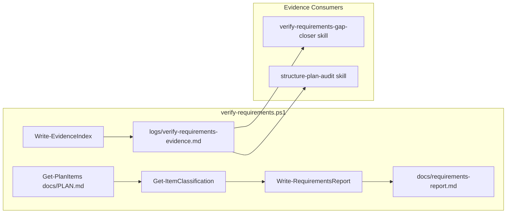

# Verify-Requirements Pipeline

## Generation Flow

1. `verify-requirements.ps1` runs and:
   - Scans `src`, `include`, `host`, `docs`, `scripts`, `tests`, `proto`
   - Writes `logs/verify-requirements-evidence.md` via `Write-EvidenceIndex`
   - Parses `docs/PLAN.md` for `AF-*` items with Target File and Validation
   - Classifies each plan item via `Get-ItemClassification`
     (`missing`/`scaffold-only`/`partial`)
   - Writes `docs/requirements-report.md` via `Write-RequirementsReport`

2. Root `PLAN.md` (gap closure plan) is not generated by the script. It is
   produced by the `verify-requirements-gap-closer` skill when an agent reads
   `logs/verify-requirements-evidence.md` and `docs/requirements-report.md`,
   then generates a dependency-ordered plan. The skill excludes plan items with
   status `verified` and only includes files with `placeholder=true` in the
   evidence.

## Misclassified Files (Pre-Fix)

<!-- markdownlint-disable MD060 -->
| File | Size | Markers | Why Misclassified |
| --- | --- | --- | --- |
| tools/plan_exec.py | 72,176 | placeholder;minimal;model | "model" in Pydantic, "minimal" in docstrings |
| tools/validation_gate.py | 16,937 | model | "model" in `BaseModel`, `model_validator` |
| tools/agent_call.py | 5,543 | model | "model" in API/LLM context |
| tools/context_utils.py | 3,999 | model | "model" in data-model context |
| tools/gbnf_grammars.py | 4,128 | model | "model" in grammar/model context |
| tools/json_utils.py | 5,909 | model | "model" in data-model context |
| src/aetherflow/core/entitlements.py | 3,538 | model | "model" in Pydantic/schema context |
| src/aetherflow/core/shared_memory_layout.py | 7,262 | minimal;descriptor | "descriptor" in proto/shmem context |
| src/aetherflow/proto/capture_pb2.py | 3,699 | descriptor | Generated proto; "descriptor" is structural |
| docs/PLAN.md | 31,883 | placeholder;minimal;model | "model" in completion policy ("model-only wrappers") |
| docs/PRD.md | 16,046 | model | "model" in requirements terminology |
<!-- markdownlint-enable MD060 -->

Root cause: `Get-PlaceholderMarkers` includes `model`, `minimal`, and
`descriptor`, which are common in real code (Pydantic, protobuf, docs).
`Test-Placeholder` returns true if any marker appears, so large files are
flagged.

## Heuristics (Post-Fix)

- Evidence placeholder = `Test-Placeholder` OR `Test-ThinCode`. Structurally
  thin files are flagged even without explicit markers.
- Explicit scaffolding markers: `TODO`, `placeholder`, `should implement`,
  `This file should implement`, `This header should define`, and similar
  markers.
- Contextual `minimal` marker: files < 2000 bytes containing `minimal` in
  docstrings are flagged. Large files (`plan_exec.py`, and similar) are not
  affected.
- Thinness (`Test-ThinCode`): Python: < 500 bytes, or no `def`, or (< 800 bytes
  and < 2 defs). Mature override: size >= 1500 and (def >= 3 or class >= 2).
- Structural overrides (`Test-MatureFile`): same thresholds; generated proto
  files are always mature.
- Opt-out: `# evidence: mature` comment opts a file out of placeholder
  detection.
- Test strength: `pytest.raises` and `@pytest.mark.parametrize` count toward
  assertion strength. Integration/UI tests use threshold 1; others use 2.
- Status: plan items are classified as `verified`, `scaffold-only`, or
  `missing`. Verified items are excluded from gap-closure plans.

## Debug And Regression Tests

- Debug mode: run
  `powershell -File .cursor/workflows/verify-requirements.ps1 -Debug`
  to print heuristic results (mature, markers) for a golden set of files.
- Golden test:
  `uv run pytest tests/contracts/test_verify_requirements_evidence.py`
  asserts expected placeholder status for key files. Update
  `GOLDEN_EXPECTATIONS` when heuristics or implementation intentionally change.
